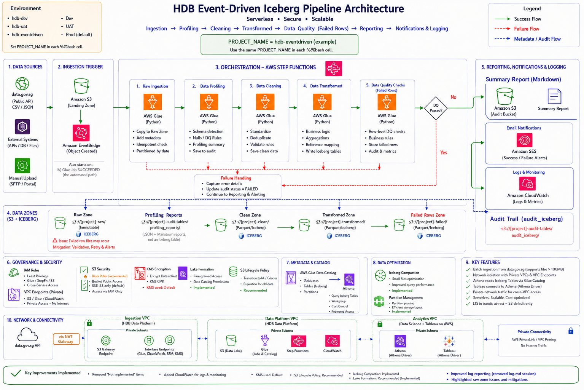
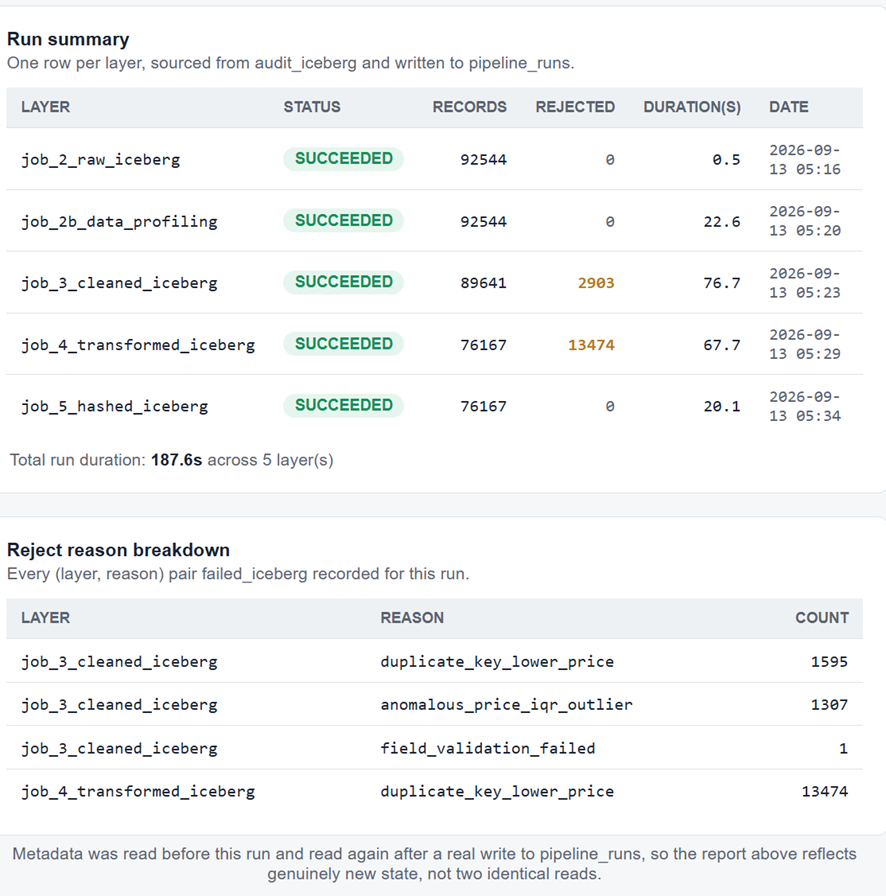
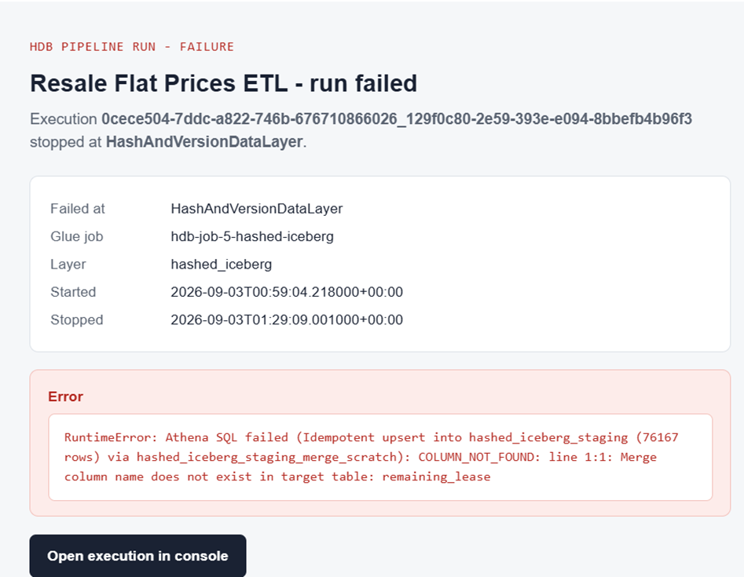

# HDB Resale Flat Prices Pipeline

An event-driven, serverless ETL pipeline for HDB's public Resale Flat Prices dataset (Jan 2012–Dec 2016) — from raw ingestion through five governed Iceberg layers to a reporting email, with no server ever provisioned or kept running.

## Purpose of this project

This project builds a serverless ETL pipeline for HDB's public Resale Flat Prices dataset, covering January 2012 to December 2016. It ingests resale transaction records (via an automated data.gov.sg pull or a manual upload), validates them against the required business rules, derives and hashes a Resale Identifier, and lands the result in governed Iceberg tables that downstream analysts and tools can query directly. The whole run is event-driven end to end, notifies a subscriber by email on every success or failure, and runs entirely on AWS-managed serverless services — nothing here needs a server to be provisioned or kept running.

## Deploying the pipeline

The AWS infrastructure for this pipeline can be provisioned in one of two ways:

1.  **Run the CI/CD pipeline** — push to the `main` branch. GitHub Actions automatically lints the changed scripts, deploys them to S3, and regenerates/updates the Step Functions state machine so it always matches what's in source control.
2.  **Run it locally** — from a bash shell, run the setup script directly. It provisions every resource in one pass: the S3 buckets, the Glue Data Catalog and jobs, the IAM roles, the Step Functions state machine, the SNS notification topic, and the EventBridge rules that make the whole thing event-driven.

    bash pipeline-scripts/infrastructure_files/03_bash_scripts/setup.sh

`setup.sh` is idempotent — running it again when the infrastructure already exists is harmless, so it's safe to re-run after a partial failure or a config change.

To tear everything down cleanly (for a fresh test cycle, or to avoid ongoing AWS costs), run:

    bash pipeline-scripts/infrastructure_files/03_bash_scripts/tear_down.sh

The Step Functions state machine definition itself is generated, not hand-written — `pipeline-scripts/05_ETL/build_state_machine_definition.py` builds it from the current Glue job names, IAM role, Lambda ARN, and notification settings. After a logic change, redeploying means regenerating this file and pushing it with `aws stepfunctions update-state-machine`, not hand-editing a static JSON definition.

## Ingestion types

Once the infrastructure is deployed, data can enter the pipeline two ways — both are treated identically by every stage that follows, neither is a "lesser" path:

1.  **Automated ingestion** — pulls the full "Resale Flat Prices" collection from data.gov.sg's public API and lands it in S3. It can be run directly from bash, or left to fire on its own schedule/trigger. When it finishes successfully, an event rule detects it and automatically kicks off the rest of the pipeline — no manual trigger needed after this point.

2.  **Manual upload** — drop a CSV directly into the manual-upload location in the source bucket. A separate event rule watches this location and starts the same pipeline immediately, without needing the automated pull to run first.

Both routes converge on the same first processing step, so a manually-uploaded file is combined with any automated data and carried through every remaining stage exactly the same way.

## End-to-end serverless architecture

Nothing in this pipeline runs on a server you provision or manage — every piece is a fully-managed AWS service that scales automatically and only costs money while it's actually doing work. The diagram below reflects the actual deployed Step Functions state machine (generated by `build_state_machine_definition.py`), not a simplified sketch — every box is a real state, table, or event rule.

A few things this diagram makes explicit that are easy to miss reading the code alone:

  - **Ingestion is deliberately not a state in the state machine at all.** `job_1_ingestion_to_source` runs standalone; it's the Glue job's own `SUCCEEDED` event (or a manual upload's `S3 ObjectCreated` event) that triggers Step Functions to start — so a partial or slow ingestion never blocks the state machine from existing, and the state machine's own timeout only ever covers stages 2 onward.
  - **No step has an inline `Catch`.** A real failure propagates uncaught and stops the execution *at* the actual failing step, which is what makes AWS's Redrive feature useful — it resumes from that real step, skipping everything that already succeeded, rather than from a dead-end `Fail` state. Failure detection and alerting happen entirely out-of-band, via a separate EventBridge rule watching this state machine's own execution-status events.
  - **`failed_iceberg` is a side channel, not a dead end.** Every layer from `job_3` onward can route a rejected row there (tagged with the reason and the stage that rejected it) while its otherwise-valid rows continue down the main path — a bad record never blocks a good one.
  - **The success report is built once, reused twice.** `RecordRunSummary` writes real numbers to `pipeline_runs`, and both the S3-persisted report (written directly by the Lambda, not by a separate Step Functions state) and the emailed one are built from that same freshly-verified data — not two independent (and possibly inconsistent) summaries.

## Email notifications — success or failure

An email is sent automatically at the end of every run, regardless of outcome:

  - **On success** — a formatted HTML report confirms the run completed: stat tiles (steps succeeded, rows ingested, rows in the final hashed layer, total rejected), a per-layer run-summary table, and a reject-reason breakdown table, all sourced from the metadata written to `pipeline_runs` for that run. When SES is configured (see below), the same report is also saved as a standalone `.html` file in the audit bucket, under `alert-logs/success/<execution-name>.html`, so a run's report can be retrieved later without digging through the inbox.
  - **On failure** — as soon as any stage fails, the workflow stops that path immediately and sends a failure email naming which stage failed and why, instead of continuing silently or failing without any notice.

Either way, no one needs to check the AWS console to know how a run went — the result lands directly in the inbox of whoever is subscribed to the notification topic.

Email delivery uses **Amazon SES** when a sender and recipient are configured at deploy time (`USE_SES` in `build_state_machine_definition.py`), falling back to a plain-text **SNS** notification otherwise — SNS can't render HTML, so the polished report and the persisted `.html`/`.md` copies are both SES-only features. The persisted copies are written directly from the Lambda (`_persist_run_report`, via a plain `boto3` `s3_client.put_object(Body=...)` call) rather than through a Step Functions state — Step Functions JSON-encodes any dynamically-resolved value it writes into an `aws-sdk:s3:putObject` state's Blob-typed `Body` field, regardless of how that value is referenced, which would corrupt the HTML/Markdown content. Writing the bytes directly from the Lambda sidesteps that entirely.

## Sample outcome

What the report looks like on a real run — a clean pass on the left, a failed step on the right.

|                               |                               |
| ----------------------------- | ----------------------------- |
|  |  |

## Metadata-driven

Every run is driven by metadata, not hardcoded logic:

  - Pipeline parameters (which tables exist, whether a stage does a full reload or an incremental merge, lookback windows, etc.) are read live from metadata tables rather than baked into the code — changing behaviour is a metadata change, not a code change.
  - A **context** is created at the start of a run and updated as it progresses, capturing what actually happened at each stage.
  - That context is what the final email summary is built from — the notification reflects the real recorded outcome of the run, not just "it finished."

## Analytics access

The same data this pipeline produces is immediately queryable by others, with no separate export step:

**AWS Glue Data Catalog → Amazon Athena → Tableau (or any BI/analytics tool)**

Views can be created on top of the Iceberg tables in the Glue Data Catalog, then queried directly through Athena — giving analysts, data scientists, or a BI tool like Tableau governed, read-only access to the data without needing their own copy or a separate pipeline.

## Overall pipeline characteristics

  - **Idempotent** — rerunning a stage with the same input produces the same end state, never duplicate data
  - **Scalable** — every component (Glue, Step Functions, Athena, S3, Lambda) is serverless and scales automatically with data volume
  - **Supports full and incremental load** — each table's load strategy (full reload vs. merge/upsert) is a metadata setting, not hardcoded per stage
  - **Robust** — validation and quarantine rules mean bad records are isolated, not silently dropped or allowed to break a run
  - **Logging** — every run is recorded with what went in, what came out, and what was rejected, at every stage
  - **Retry & recovery** — transient AWS-side failures are retried automatically where safe to do so, and a failed run's exact failure point is captured and emailed immediately rather than failing silently
  - **Apache Iceberg table format** — every stage's table gets schema evolution (new columns can be added without rewriting existing data), time travel (querying a table as of an earlier snapshot), and partitioning (organizing data on disk for faster, cheaper queries) — all for free from the table format itself, not custom-built
